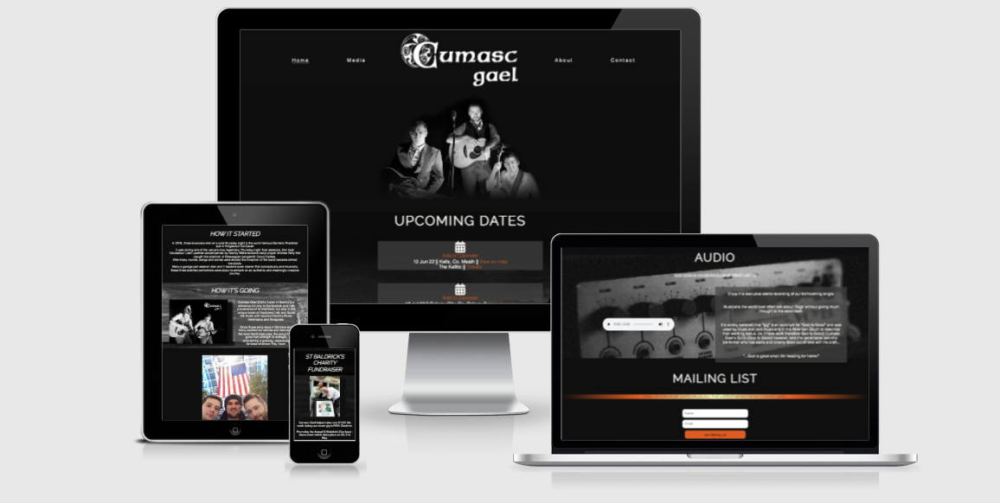
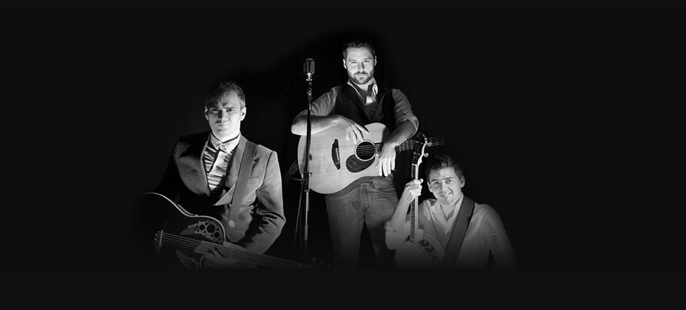
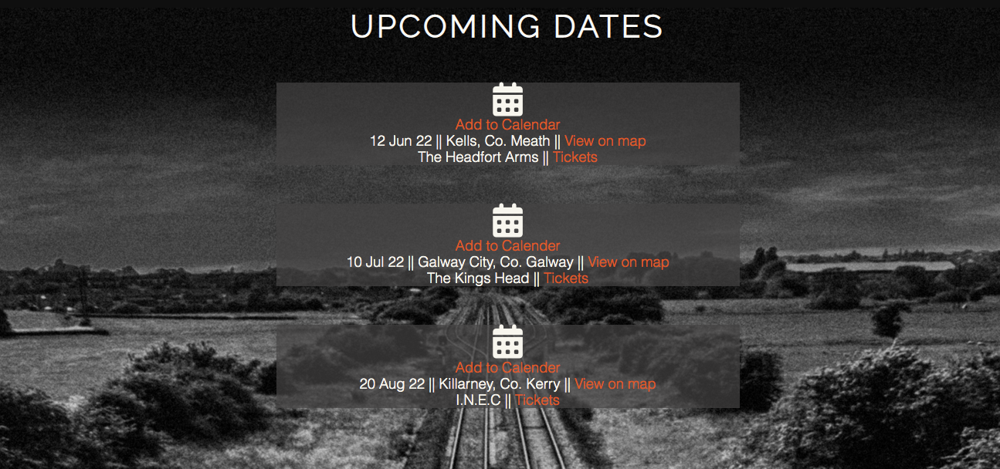
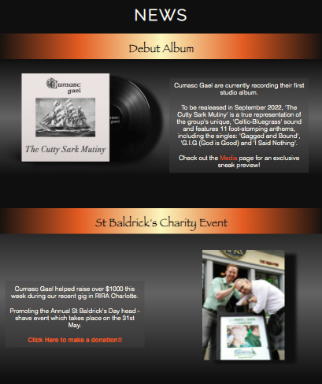
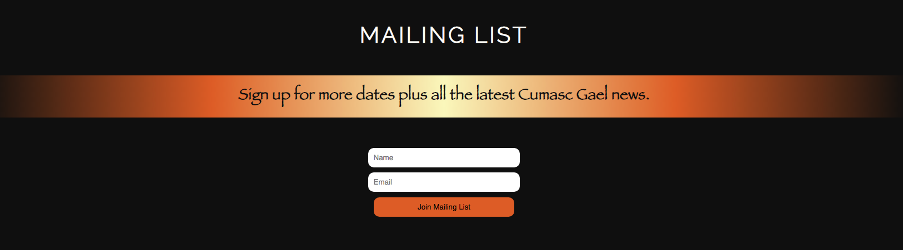
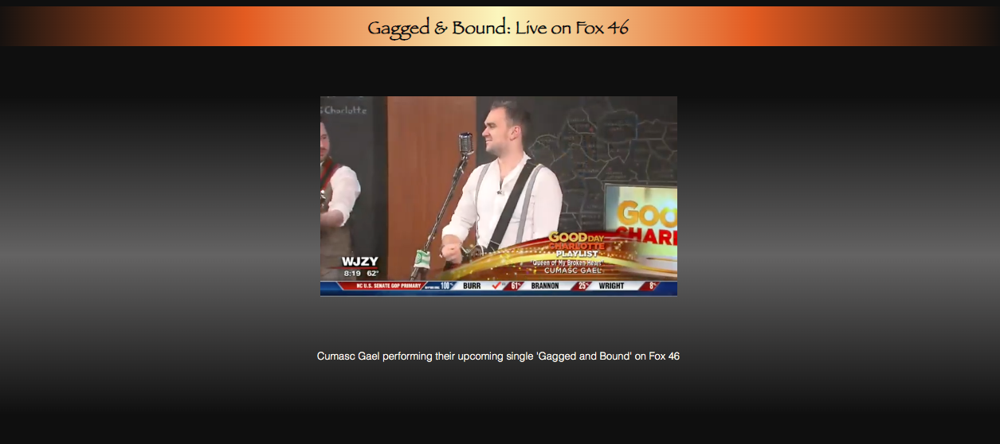
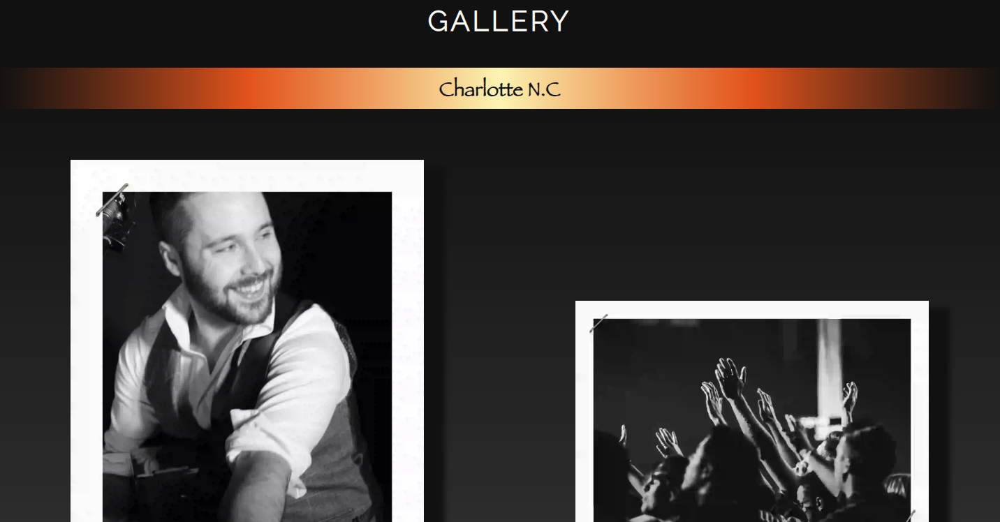
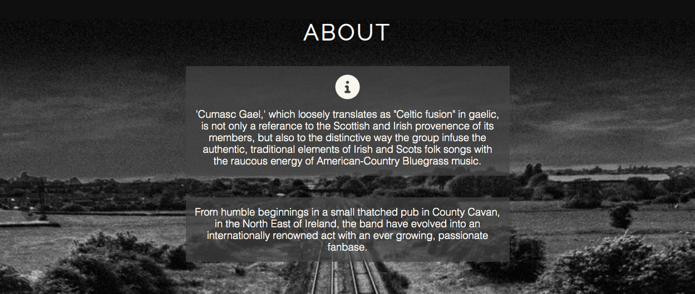
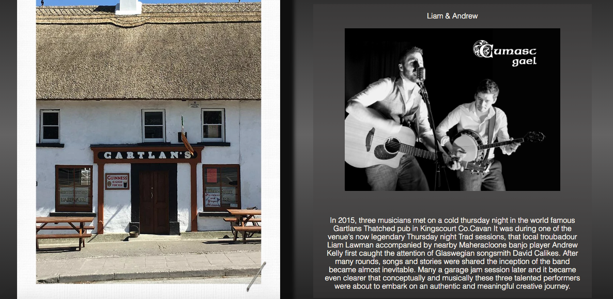

# Cumasc Gael

Cumasc Gael are a Celtic Bluegrass band, based in the North East of Ireland. 
Primarily functioning as a promotional tool for the band, this website will provide an insight into the groups musical and artistic identity, personality, and style through its design, functionality, and content.
With its user centered design, functionality, and exclusive media content and intuitive functionality, Cumasc Gael aims to provide their target audience with a positive and satisfying user experience.
The website will also serve to demonstrate the bands asthetic, musical abilities and stage footprint to A&R reps, booking agents and venues. 

   

# Features
Below are some features the site currently has to offer and also some features which may be added in future.

## Existing Features ##

* ### Navigation Bar

    * The navigation bar is fully responsive and uniform across all four pages of the site.

    * The section includes links to the Home, Media, About and Contact pages.
    * Each navigation link has a hover feature providing visual feedback for the user. Each page has a separate active link which provides the user instant feedback regarding their location on the site.

 

* Main Image 

    * The main image or hero image of the site includes a photograph of the band which fades in from black. 
    
    * Not only is the fade animation visually arresting but the subject matter of the picture immediately informs the user of the formation and visual style of the band whilst also being suggestive of musical genre.

 

* ### Sticky Navigation Menu   

    * The Sticky Navigation Menu sticks to a fixed position at the top of the screen when a user scrolls past the hero image section.
    
    * This feature allows users to access any pages of the site without the requirement of scrolling back to the top of the page.

    * The Sticky Navigation Menu takes up very little screen space and therefore doesnt obstruct any of the sites content.
    
    * This feature is intuitively designed with a recognisable 'burger' style icon and is easily accessible for the user.

* ### Upcoming Dates Section

    * The Upcoming Dates Section will inform users of the dates, locations and venues of the bands scheduled live performances.

    * The section includes a feature that allows users to add the dates directly to their personal google calender.
    
    * Users can also view the location of each venue via a link to google maps.

    * The section also provides users with a link to purchase tickets for each show.

* ### Band News Section

    * The Band News section provides users with news updates featuring the band and aims to generate a sense of community and connection by offering its users a positive and virtuos news stories about the band.   

    * Each news item contains compact yet engaging stories that keeps users informed and interested.
    
    * The section provides vibrant, colorful headings to each news item. These headings serve as a buffer between each story providing users with a visual cue for the beginning of each news story.

    * The band news section also provides users with story specific links should they wish to interact and engage with each section. Each news item link has a hover feature providing visual feedback for the user.
    
    * This section also provides vibrant, colorful headings to each news item. These headings serve as a buffer between each story providing users with a visual cue for the beginning of each news story.

 

* ### Mailing List Section    
    
    * The Mailing List section invites users to fill out a simple form in order to recievee band news and gig updates via email. 

    * Users will have to provide a name and valid email address in order to subscribe.
    
    * The Mailing List also has a stylised heading providing a continuity of design across the home page and the website as a whole. 

* ### Fire Image   

    * The Fire Image acts as a visual indicator to signify the end of page specific content.
    
    * The fire image is consistent with the style of the site and evokes the "Guilded Age" aesthetic of the group.

* ### The Footer  

    * The footer section of the site provides links to the band's social media pages. The links all open in a new tab and contain descriptive title attributes for accessibility  
    
    * The social media links provided will visually propmt users to visit the bands social media pages with the aim of increasing the bands online following. 

* ### The Audio Section 

    * The audio section provides users with the option to listen to the music of Cumasc Gael.  
    
    * The music in the Audio section does not play automatically to enhance the user experience.

    * The audio section provides the user with content exclusive to the site.

    * The songs in the audio section are relevant to the site's subject matter and consistent in style and design with other media and text across the site.

    

    * ### The Video Section 

    * The video section provides users with the option to view video content featuring the band. 
    
    * The video in this section does not play automatically to enhance the user experience.

    * The video section provides the user with content relevant to the subject matter of the site.

    

* ### The Gallery

    * The site Gallery provides users with the option to view still images of the band. 
    
    * The content in this section offers the user an insight into the style and energy of a Cumasc Gael live show.

    * The Gallery section also provides the user with exclusive backstage and travelogue photo content. 

     * The section is organised into three different categories, each clearly separated by a distinctive, stylised heading that's consistent in style with the rest of the site. 

    

    * ### Upper Bigraphy Section

    * The Upper Biography Section allows the user to access the most pertinent information about the group. 
    
    * The content in this section provides users with a simple and interesting overview of the band. Succinct and informative. the compressed nature of this section engages users and encourages scrolling.

    

     * ### Lower Bigraphy Section

    * The Lower Biography Section allows the user to access more detailed information about the group. 
    
    * The content in this section provides users with an informative and engaging learning experience.

    * Each biographical element has an accompanying image relevant to the text content. 

    * The section is again organised into different elements explaining the past present and future direction of the band, with each element clearly separated by a distinctive, stylised heading that's consistent in style with the rest of the site. 

    

    * ### Possible Future Features

    * In future the site aims to include a web store for users to purchase content and merchandise.
    
    * The site aims to provide a video landing image in the future.
 

