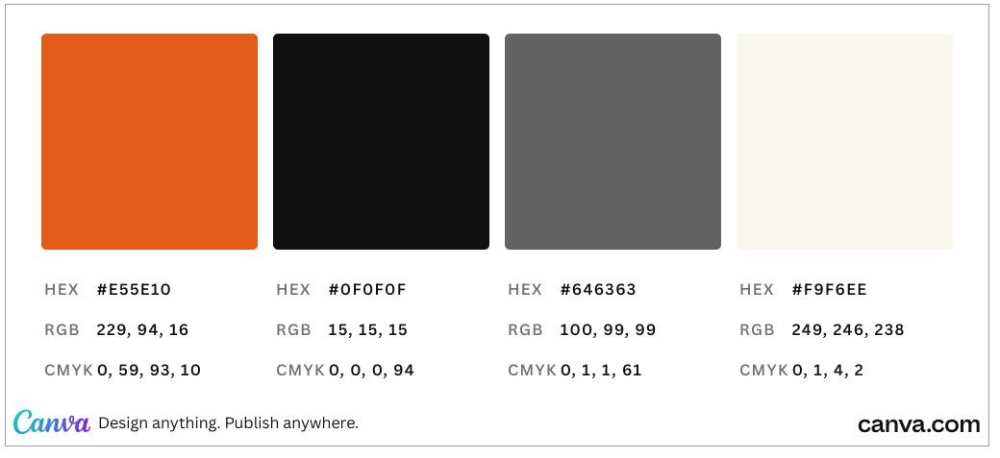
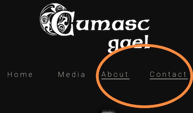

# Cumasc Gael

Cumasc Gael are an emerging celtic-bluegrass band based in the North East of Ireland. 

Functioning as a promotional tool for the band, this website will help market the music and image of Cumasc Gael to their specified target audience.

By presenting the artistic identity and personality of Cumasc Gael the site aims to provide users with a positive emotional experience underpinned by the groups creative output and style. 

## Planning & Development

- __Business Strategy__

     Recently, the band have moved away from the Irish cover-band circuit to performing their own songs, both as a support band for similar established acts and also as a headline act themselves in some of Ireland's smaller yet renowned indie venues.
 
     The band have since recieved multiple invitations to perform globally, and have recently conducted a small American tour which was extremely well recieved.
    
     Due to the growing popularity of the band, they now require an industry standard "Electronic Press Kit" to promote themselves and their exciting new direction.
     
     Focusing on user centered design, functionality, and exclusive media content, Cumasc Gael aims to provide its specified target audience with a positive and satisfying user experience.
     
- __Target Audience__

    Cumasc Gael are now aiming to share the same market space as similar acts within the indie/bluegrass genre.

    
    

    By collating information gleaned from the targeted Facebook ad campaigns of these groups I have determined the following.

    * Women account for 60% of the target audience
    
    * 24-34 is the key age demographic of the target audience.

    - __Targeting Key Demographics__

    The site's content and how it is displayed is informed by the outcomes of my reasearch . An example of this is presented below. 
    
    According to marketing website [socialtoaster.com](https://www.socialtoaster.com/marketing-to-a-female-demographic-6-tips/),
     women (as an audience) respond positively to social stories that are seen to champion a cause. Women are also interested in compelling news items. 

     

    In light of this data, (and because women make up the majority of the site's target audience) I have included a news section on the first page of the website featuring a positive social story, in which the band are clearly seen to be championing a worthy cause. 

    

* ### User Stories

    * As a user, I want to find out more about Cumasc Gael.
 
    * As a User, I want to find the most relevant information quickly and intuitivly.
    
    * As a user, I want access to exclusive media content.

    * As a user, I want to have a positive emotional experience.
    
    * As a user, I want to sign up to a mailing list to stay informed.

* ### Site Objectives

    * The Site aims to provide information about Cumasc Gael to a general audience including fans of Traditional and Bluegrass music, but also interested industry professionals.

    * The Site Aims to act as an Electroninc Press Kit, for professional use within the music industry.
    
    * Another aim of this site, is to provide exclusive media content to the user.

    * The site also aims to increase the fanbase of Cumasc Gael by providing users with a positive emotional experience and a mailing list subscription option.

* ### Approach

    * The information will be provided to the user on a value scale with the most important content immediately visible.  

    * The site will provide users links through which they can book tickets to see the band.

    * The site will provide users with links to venue locations and the option to add show dates to google calender
    
    * The site will provide exclusive media content to all users such as Embedded audio files, youtube videos and photo gallery.

    * The content of the site will be inoffensive and accesible to all.

    * The site will be easy to navigate, intuitive and consistent in design.

    * The site will provide a method through which users can subscribe to a mailing list. 

 

* ### Wireframes  

    Desktop, tablet and mobile wireframes were created using Balsamiq software to give a general overview of the layout of the site and organise the content logically. An image is posted of one of the wireframes below. Links to each wireframe set are also available.

   

    * [Home page wireframes](README_images/wireframes/home_wf.pdf)

    * [Media page wireframes](README_images/wireframes/media_wf.pdf)
    
    * [About page wireframes](README_images/wireframes/about_wf.pdf)

    * [Contact page wireframes](README_images/wireframes/contact_wf.pdf)

    The site conforms to the general structure and scope of these wireframes yet deviates significantly with respect the colour scheme. 

* ### Colour Scheme

    * The predominant feature of the color scheme is undoubtebtly greyscale.
    This stylistic choice and evoke's what the band calls its "Gilded Age" aesthetic, the gilded age being an era before color photography and where traditional music was the popular genre. 

    * The orange in the color scheme is referenced from the fire footer padding image and again is suggestive of a rustic and simpler epoch.  
    
    * The fire image was deliberatly included as flames and fire are also heavily featured in the band's upcoming music video for thier latest single.

# Typography

* ### There are three fonts used throughout the site.

    * Quintessential: A cursive font to envoke the band's aesthetic is used for section headings.

    * Raleway: A popular sans serif font often utilised in modern music websites is used for section sub-headings.  
   
    * Helvetica: A clear, complimentary font often partnered with Raleway is used for all other text.

    The fonts were imported to the stylesheet via google fonts.

# Features
Below are some features the site currently has to offer and also some features which may be added in future.

## Existing Features ##

* ### Navigation Bar

    * The navigation bar is fully responsive and uniform across all four pages of the site.

    * The section includes links to the Home, Media, About and Contact pages.
    * Each navigation link has a hover feature providing visual feedback for the user. Each page has a separate active link which provides the user instant feedback regarding their location on the site.

 

* Main Image 

    * The Main Image is available accross all four pages of the site.

    * The main image or hero image of the site includes a photograph of the band which fades in from black. 
    
    * Not only is the fade animation visually arresting but the subject matter of the picture immediately informs the user of the formation and visual style of the band whilst also being suggestive of musical genre.

 

* ### Sticky Navigation Menu   

    * The Sticky Navigation Menu sticks to a fixed position at the top of the screen when a user scrolls past the hero image section.
    
    * This feature allows users to access any pages of the site without the requirement of scrolling back to the top of the page.

    * The Sticky Navigation Menu takes up very little screen space and therefore doesnt obstruct any of the sites content.
    
    * This feature is intuitively designed with a recognisable 'burger' style icon and is easily accessible for the user.

     

* ### Upcoming Dates Section

    * The Band News section is located on the Home page.

    * The Upcoming Dates Section will inform users of the dates, locations and venues of the bands scheduled live performances.

    * The section includes a feature that allows users to add the dates directly to their personal google calender.
    
    * Users can also view the location of each venue via a link to google maps.

    * The section also provides users with a link to purchase tickets for each show.

* ### Band News Section

    * The Band News section is located on the Home page.

    * The Band News section provides users with news updates featuring the band and aims to generate a sense of community and connection by offering its users a positive and virtuos news stories about the band.   

    * Each news item contains compact yet engaging stories that keeps users informed and interested.
    
    * The section provides vibrant, colorful headings to each news item. These headings serve as a buffer between each story providing users with a visual cue for the beginning of each news story.

    * The band news section also provides users with story specific links should they wish to interact and engage with each section. Each news item link has a hover feature providing visual feedback for the user.
    
    * This section also provides vibrant, colorful headings to each news item. These headings serve as a buffer between each story providing users with a visual cue for the beginning of each news story.

 

* ### Mailing List Section    

    * The Mailing List Section is available across all four pages of the site.
    
    * The Mailing List section invites users to fill out a simple form in order to recievee band news and gig updates via email. 

    * Users will have to provide a name and valid email address in order to subscribe.
    
    * The Mailing List also has a stylised heading providing a continuity of design across the home page and the website as a whole. 

* ### Fire Image   

    * The Fire Image acts as a visual indicator to signify the end of page specific content.
    
    * The Fire image is consistent with the style of the site and evokes the "Guilded Age" aesthetic of the group.

* ### The Footer  

    * The Footer is located at the bottom of all four pages of the site.

    * The Footer section of the site provides links to the band's social media pages. The links all open in a new tab and contain descriptive title attributes for accessibility. 
    
    * The social media links provided will visually propmt users to visit the bands social media pages with the aim of increasing the bands online following. 

* ### The Audio Section 

    * The Audio section is located on the Media page.

    * The audio section provides users with the option to listen to the music of Cumasc Gael.  
    
    * The music in the Audio section does not play automatically to enhance the user experience.

    * The audio section provides the user with content exclusive to the site.

    * The songs in the audio section are relevant to the site's subject matter and consistent in style and design with other media and text across the site.

    

    * ### The Video Section 

    * The Video section is located on the Media page.

    * The video section provides users with the option to view video content featuring the band. 
    
    * The video in this section does not play automatically to enhance the user experience.

    * The video section provides the user with content relevant to the subject matter of the site.

    

* ### The Gallery

    * The Gallery section is located on the Media page.

    * The site Gallery provides users with the option to view still images of the band. 
    
    * The content in this section offers the user an insight into the style and energy of a Cumasc Gael live show.

    * The Gallery section also provides the user with exclusive backstage and travelogue photo content. 

     * The section is organised into three different categories, each clearly separated by a distinctive, stylised heading that's consistent in style with the rest of the site. 

    

    * ### Upper Bigraphy Section

    * The Upper Biography section is located on the about page.

    * The Upper Biography Section allows the user to access the most pertinent information about the group. 
    
    * The content in this section provides users with a simple and interesting overview of the band. Succinct and informative. the compressed nature of this section engages users and encourages scrolling.

    

     * ### Lower Bigraphy Section

    * The Lower Biography section is located on the about page. 

    * The Lower Biography Section allows the user to access more detailed information about the group. 
    
    * The content in this section provides users with an informative and engaging learning experience.

    * Each biographical element has an accompanying image relevant to the text content. 

    * The section is again organised into different elements explaining the past present and future direction of the band, with each element clearly separated by a distinctive, stylised heading that's consistent in style with the rest of the site. 

    

    * ### Contact section

    * The Contact section is located in the Contact page
    
    * The Contact section allows the user to access the groups contact infomation 
    
    * The Contact section provides direct links to email the band's tour and managment companies.

    

    * ### Possible Future Features

    * In future the site aims to include a web store for users to purchase content and merchandise.
    
    * The site aims to provide a video landing image in the future.

    # Testing

    * ### Development Testing

    As this was my first project as a developer, I decided to create a practice repository to test how each part of my code would respond after deployment to several different browsers, devices and operating systems.  

    Initially I was experimenting with how to best use a flexible box model to replicate the look and responsivity of my wireframes. 

    The link to my practice repository is available below.

    * [Cumasc Gael -- Practice Repository](https://github.com/davidcalikes/flex-test)

Much like the wireframes developed during the planning process, the practice repository differs in many areas from the final project. These changes were made not only to improve the look and consistency of the site, but to reduce screen loading times and optimise user experience. I also managed to achieve similar, if not improved results and performance using significantly less lines of code as I began to progress and learn as a developer.  

* ### Testing Technologies 
    I rigorously tested the site during the development phase using using the following:
    * Mac Pro with a 21" Apple Cinema display -- Safari, Chrome and Firefox

    * Macbook pro 13" -- Safari, Chrome and Firefox

    * Toshiba Laptop 15" (Windows 10) -- Edge, Chrome and Firefox

    * Apple iPad Mini (5th gen) -- Safari and Chrome

    * Huawei P20 Pro Android Phone -- Chrome and Firfox

    * Samsung Galaxy Tab 7" -- Chrome

    I also used Google Dev-tools to test the sites responsivity in real time and also emulate the sites appearance and responsivity across several other devices.

    

* ### Validator Testing

    * All pages of the site were passed through the W3C Validator and are error free.
 
    * The CSS stylesheet was passe through the Jigsaw Validator and returned no errors.

* ### Unfixed Bugs

    * On some touchscreen devices an error occurs due to the hover psuedo class which fails to deselect a nav link when a user returns to the previous page via the back arrow.

     

* ### Deployment

    * As a user, I want to find out more about Cumasc Gael.
 
    * As a User, I want to find the most relevant information quickly and intuitivly.
    
    * As a user, I want access to exclusive media content.

    * As a user, I want to have a positive emotional experience.

   

* ### Languages

    * As a user, I want to find out more about Cumasc Gael.
 
    * As a User, I want to find the most relevant information quickly and intuitivly.
    
    * As a user, I want access to exclusive media content.

    * As a user, I want to have a positive emotional experience.

    * ### Software

    * As a user, I want to find out more about Cumasc Gael.
 
    * As a User, I want to find the most relevant information quickly and intuitivly.
    
    * As a user, I want access to exclusive media content.

    * As a user, I want to have a positive emotional experience.

* ### Content

    * As a user, I want to find out more about Cumasc Gael.
 
    * As a User, I want to find the most relevant information quickly and intuitivly.
    
    * As a user, I want access to exclusive media content.

    * As a user, I want to have a positive emotional experience.

* ### Media

 

