# Cumasc Gael

Cumasc Gael are an emerging celtic-bluegrass band based in the North East of Ireland. 

Functioning as a promotional tool for the band, this website will help market the music and image of Cumasc Gael to their specified target audience.

By presenting the artistic identity and personality of Cumasc Gael the site aims to provide users with a positive emotional experience underpinned by the band's creative output and style. 

## Contents
[Planning & Development](https://github.com/davidcalikes/portfolio-project-one/blob/main/README.md#planning--development)

[Features](https://github.com/davidcalikes/portfolio-project-one/blob/main/README.md#features)

[Testing](https://github.com/davidcalikes/portfolio-project-one/blob/main/README.md#testing)

[Deployment](https://github.com/davidcalikes/portfolio-project-one/blob/main/README.md#deployment)

[Languages](https://github.com/davidcalikes/portfolio-project-one/blob/main/README.md#languages)

[Software](https://github.com/davidcalikes/portfolio-project-one/blob/main/README.md#software)

[Media](https://github.com/davidcalikes/portfolio-project-one/blob/main/README.md#media)

[Credits](https://github.com/davidcalikes/portfolio-project-one/blob/main/README.md#credits)

## Planning & Development

- __Business Strategy__

     Recently, the band have moved away from the Irish cover-band circuit to performing their own songs, both as a support band for similar established acts and also as a headline act themselves in some of Ireland's smaller yet renowned indie venues.
 
     The band have since recieved multiple invitations to perform globally, and have recently conducted a small American tour which was extremely well recieved.
    
     Due to the growing popularity of the band, they now require an industry standard "Electronic Press Kit" to promote themselves and their exciting new direction.
     
     Focusing on user centered design, functionality, and exclusive media content, Cumasc Gael aims to provide its specified target audience with a positive and satisfying user experience.
     
- __Target Audience__

    Cumasc Gael are now aiming to share the same market space as similar acts within the indie/bluegrass genre.

    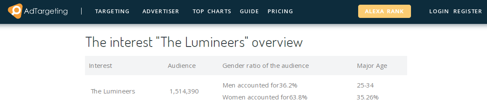
    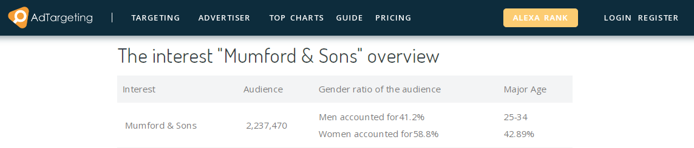

    By collating information gleaned from the targeted Facebook ad campaigns of these groups I have determined the following:

    * Women account for approximately 60% of the band's target audience
    
    * 24-34 is the key age demographic of the target audience.

- __Targeting Key Demographics__

    The site's content and how it is displayed is informed by the outcomes of the research mentioned above. I have presented one example of this below. 
    
    According to marketing website [socialtoaster.com](https://www.socialtoaster.com/marketing-to-a-female-demographic-6-tips/),
     women (as an audience) respond positively to social stories that are seen to champion a cause. Women are also interested in compelling news items. 

     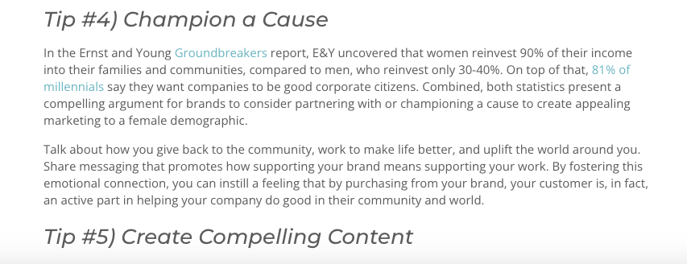

    In light of this data, (and because women make up the majority of the site's target audience) I have included a news section on the first page of the website featuring a positive social story, in which the band are clearly seen to be championing a worthy cause. 

    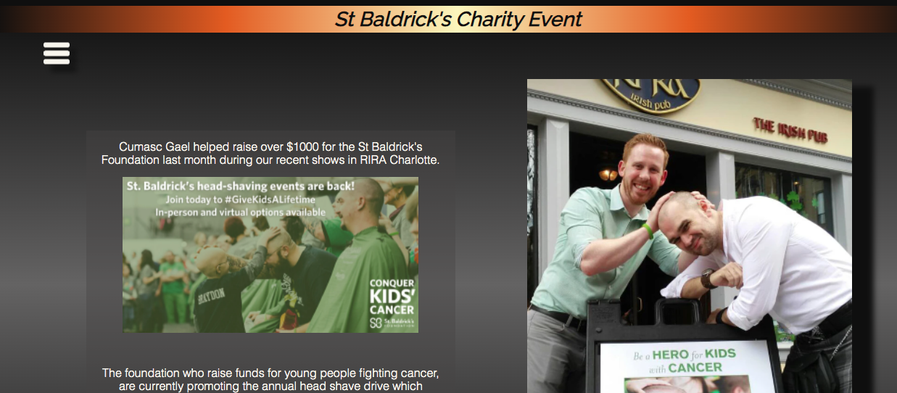

    Another way I have implemented this data is by featuring a youtube video on the Media (second) page of the site, which will appeal more to male members of the band's target audience as well the 24-34 key age demographic.

    The general artistic style of the site, (Traditional/Modern) including typograhy, color scheme and imagery also targets the key age demographic. 

    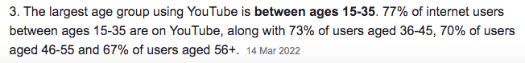
    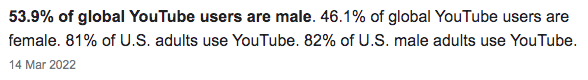

- __Target Audiences Summary__
    
    * Users who are fans of Cumasc Gael.

    * Users who are fans of Traditional Celtic and or Bluegrass music.

    * Users who are fans of Indie music.

    * Users who value worthy causes.

    * Users who are looking for exclusive content.
    
    * Users who regularly listen to music online.

    * Users who work within the music industry.

- __User Stories__

    * As a user, I want to find out more about Cumasc Gael.
 
    * As a User, I want to find the most relevant information quickly and effortlessly.
    
    * As a user, I want access to exclusive media content.

    * As a user, I want to have a positive emotional experience.
    
    * As a user, I want to sign up to a mailing list to stay informed.

- __Site Objectives__

    * To make the band imediately recognisible. 
    
    * To make the purpose of the site obvious to the user.
    
    * To provide information to the band's target audience and industry professionals about upcoming dates.

    * To communicate a charitible band ethos.
    
    * To promote the music of the band.
    
    * To act as an EPK (electroninc press kit), for professional reference within the music industry.
    
    * To provide exclusive media content to the user.

    * To increase the fanbase of Cumasc Gael by providing users with a positive emotional experience.

    * To provide users with the ability to subscribe to a mailing list. 

- __Approach__

    * The information will be provided to the user logically and informed by planning research.  

    * The site will be created following the principles of user experience design.

    * The site will provide users links through which they can book tickets to see the band.

    * The site will provide users with map links to venue locations and the option to add gig dates to Google calender.
    
    * The site will provide users with access to exclusive media content such as embedded audio files, youtube videos and a photo gallery.

    * The content of the site will be inoffensive and accesible to all.

    * The site will be easy to navigate, intuitive and consistent in design.

    * The site will provide a method through which users can subscribe to a mailing list. 

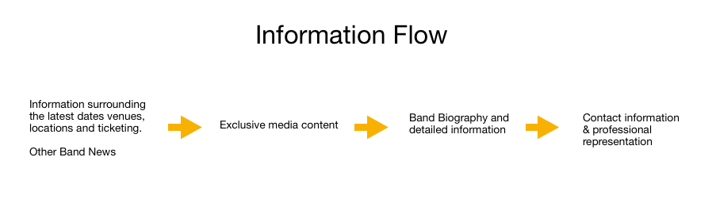

- __Wireframes__ 

    Desktop, tablet and mobile wireframes were created using Balsamiq software to give a general overview of the layout of the site and to help organise the content logically. An image is posted of one of the wireframes below. Links to each set of frames are also available.

   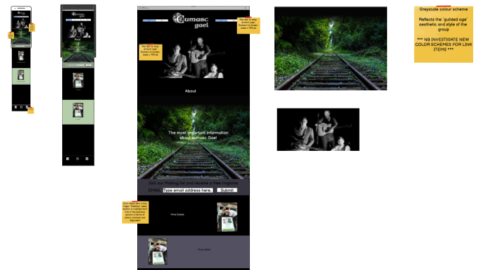

    * [Home page wireframes](assets/readme_images/wireframes/home_wf.pdf)

    * [Media page wireframes](assets/readme_images/wireframes/media_wf.pdf)
    
    * [About page wireframes](assets/readme_images/wireframes/about_wf.pdf)

    * [Contact page wireframes](assets/readme_images/wireframes/contact_wf.pdf)

    The site conforms to the general structure and scope of these wireframes yet deviates significantly with respect to the colour scheme. 

- __Color Scheme__

    * The predominant feature of the color scheme is undoubtebtly greyscale.
    This is a stylistic choice and evoke's what the band calls its "Gilded Age" aesthetic. (The gilded age being an era before color photography and where traditional and bluegrass music were popular genres of music.) 

    * The deep orange in the color scheme is referenced from the fire footer padding image and again is suggestive of a rustic and simpler epoch.  
    
    * The fire image was deliberatly included as flames and fire are also heavily featured in the band's upcoming music video for thier latest single.

    * The light orange colour was implemented to improve color contrast for increased accessibility during testing. This is referenced in the testing section of this document.

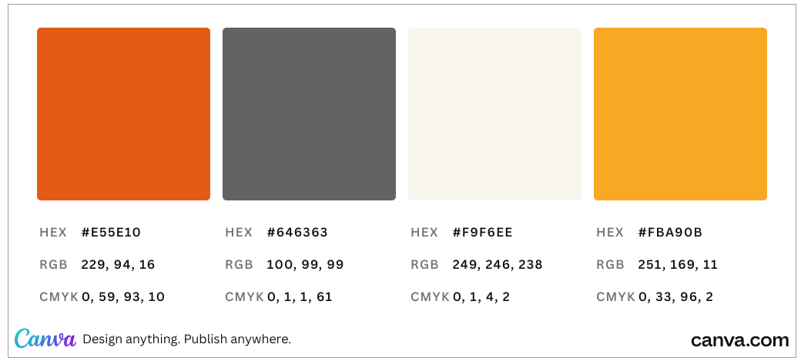

- __Typography__

*  There are three fonts used throughout the site.

    * Quintessential: A cursive font to envoke the band's aesthetic is used for section headings.

    * Raleway: A popular sans serif font often utilised in modern music websites is used for section sub-headings.  
   
    * Helvetica: A clear, complimentary font often partnered with Raleway is used for all other text.

    The fonts were imported to the stylesheet via Google fonts.

# Features #

Below are some features the site currently has to offer and also some features which may be added in future.

## Existing Features ##

- __Navigation Bar__

    * The navigation bar is fully responsive and uniform across all four pages of the site.

    * The section includes links to the Home, Media, About and Contact pages.
    * Each navigation link has a hover feature providing visual feedback for the user. Each page has a separate active link which provides the user instant feedback regarding their location on the site.

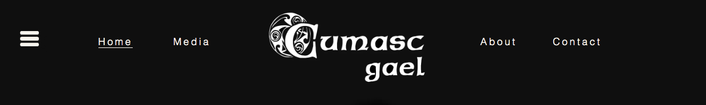 

- __Sticky Navigation Menu__   

    * The Sticky Navigation Menu sticks to a fixed position at the top of the screen when a user scrolls below the navigation section.
    
    * This feature allows users to access any pages of the site without the requirement of scrolling back to the top of the page.

    * The Sticky Navigation Menu takes up very little screen space and therefore doesn't obstruct any of the site's content.
    
    * This feature is intuitively designed with a recognisable 'burger' style icon and is easily accessible for the user.

    

- __Hero Image__ 

    * The hero image addresses one of the main aims of the site as the members of the band are all immediately identifyable and the purpose of the site is instantly obvious to the user.

    * The hero image is available accross all four pages of the site.

    * The hero image of the site includes a photograph of the band which fades in from black. 
    
    * The hero animation imitates a spotlight fading up before a performance. 

    * Not only is the fade animation visually arresting but the subject matter of the picture immediately informs the user of the formation and style of the band.

 
 

- __Upcoming Dates__ 

    * The Upcoming Dates section accomplishes a key aim of the site.

    * The Upcoming Dates section informs users of the dates, locations and venues of the bands scheduled live performances.

    * The section includes a feature that allows users to add the dates directly to their personal Google calender.
    
    * Users can also view the location of each venue via a link to Google maps.

    * The section also provides users with a link to purchase tickets for each show.

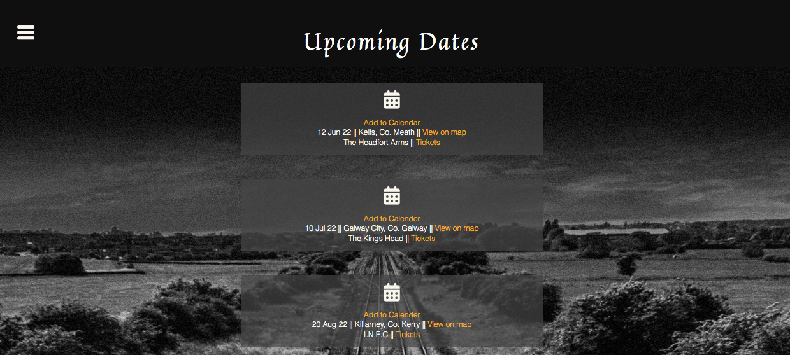

- __News Section__ 

    * The Band News section is located on the Home page.

    * As mentioned in the planning section above, the news section is targeted towards a key demographic within the band's target audience. 

    * The Band News section provides users with news updates featuring the band and aims to generate a sense of community and connection by offering its users a positive and virtuos news stories about the band.   

    * Each news item contains compact yet engaging stories that keeps users informed and interested.
    
    * The section provides vibrant, colorful headings to each news item. These headings serve as a buffer between each story providing users with a visual cue for the beginning of each news story.

    * The band news section also provides users with story specific links should they wish to interact and engage with each section. Each news item link has a hover feature providing visual feedback for the user.
    
    * This section also provides vibrant, colorful headings to each news item. These headings serve as a buffer between each story providing users with a visual cue for the beginning of each news story.

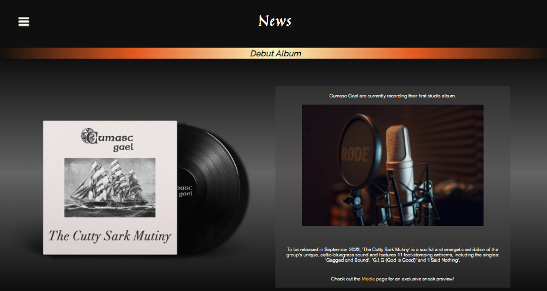

- __Mailing List__   

    * The Mailing List section is available across all four pages of the site.
    
    * The Mailing List section invites users to fill out a simple form in order to recievee band news and gig updates via email. 

    * Users will have to provide a name and valid email address in order to subscribe.
    
    * The Mailing List also has a stylised heading providing a continuity of design across the home page and the website as a whole. 

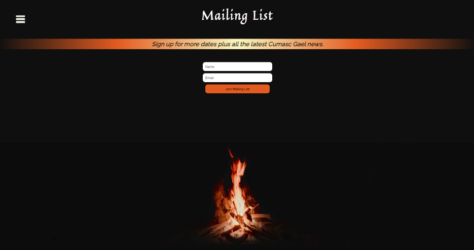

- __Fire Image__  

    * The Fire Image acts as a visual indicator to signify the end of page specific content.
    
    * The Fire image is consistent with the style of the site and evokes the "Guilded Age" aesthetic of the group.

- __The Footer__   

    * The Footer is located at the bottom of all four pages of the site.

    * The Footer section of the site provides links to the band's social media pages. The links all open in a new tab and contain descriptive title attributes for accessibility. 
    
    * The social media links provided will visually prompt users to visit the bands social media pages with the aim of increasing the bands online following. 

- __Audio Section__  

    * The Audio section is located on the Media page.

    * The audio section provides users with the option to listen to the music of Cumasc Gael.  
    
    * The music in the Audio section does not play automatically to enhance the user experience.

    * The audio section provides the user with content exclusive to the site.

    * The songs in the audio section are relevant to the site's subject matter and consistent in style and design with other media and text across the site.

    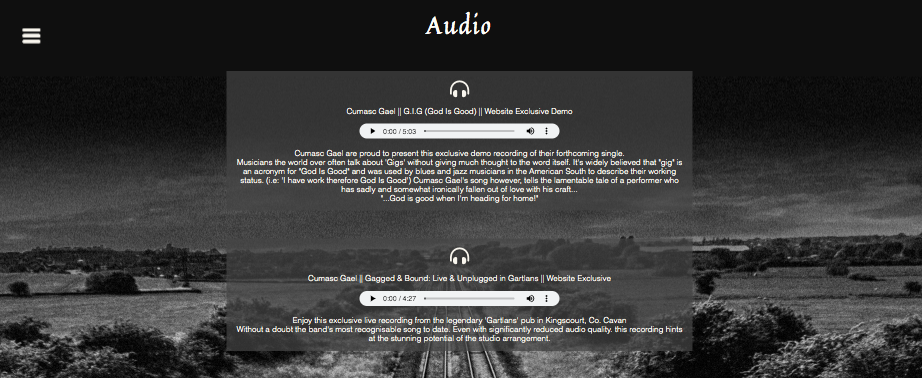
    
     

    - __Video Section__

    * The Video section is located on the Media page.

    * The video section provides users with the option to view video content featuring the band. 
    
    * The video in this section does not play automatically to enhance user experience.

    * The video section provides the user with content relevant to the subject matter of the site.

    * The video is contained within an iframe and is linked to the site via youtube.com.

    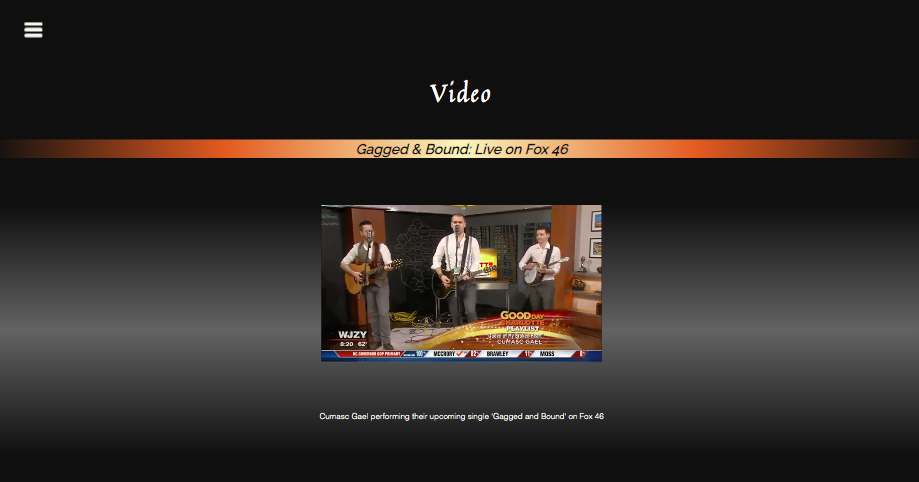

- __The Gallery__

    * The Gallery section is located on the Media page.

    * The site Gallery provides users with the option to view still images of the band. 
    
    * The content in this section offers the user an insight into the style and energy of a Cumasc Gael live show.

    * The Gallery section also provides the user with exclusive backstage and travelogue photo content. 

     * The section is organised into three different categories, each clearly separated by a distinctive, stylised heading that's consistent in style with the rest of the site. 

    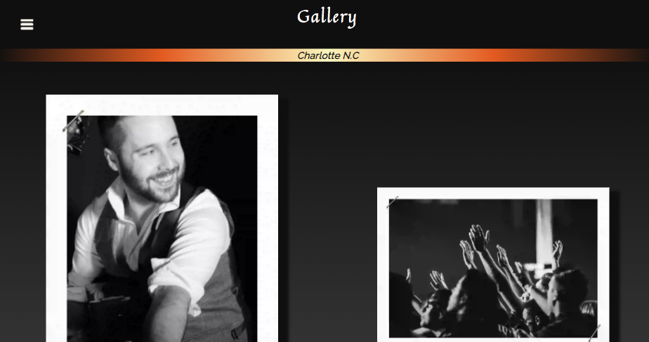
    
     

    - __Upper Biography Section__

    * The Upper Biography section is located on the about page.

    * The Upper Biography Section allows the user to access the most pertinent information about the group. 
    
    * The content in this section provides users with a simple and interesting overview of the band. Succinct and informative. the compressed nature of this section engages users and encourages scrolling.

    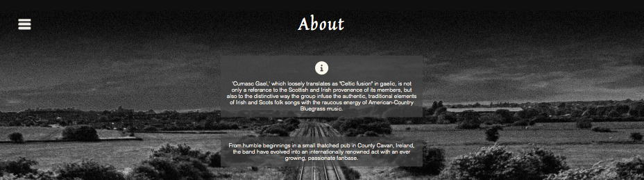
    
     

     - __Lower Biography Section__

    * The Lower Biography section is located on the about page. 

    * The Lower Biography Section allows the user to access more detailed information about the group. 
    
    * The content in this section provides users with an informative and engaging learning experience.

    * Each biographical element has an accompanying image relevant to the text content. 

    * The section is again organised into different elements explaining the past present and future direction of the band, with each element clearly separated by a distinctive, stylised heading that's consistent in style with the rest of the site. 

    

   - __Contact Section__

    * The Contact section is located in the Contact page
    
    * The Contact section allows the user to access the groups contact infomation 
    
    * The Contact section provides direct links to email the band's tour and managment companies.

    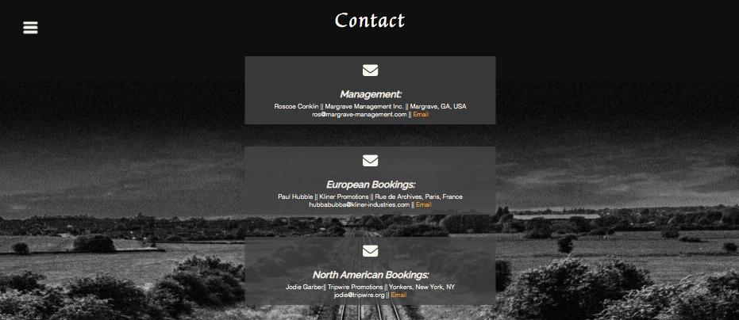

     

- __Possible Future Features__

     * The site aims to incorporate Javascript elements in the near future to make the site more interactive. This could include a "virtual fan wall" where registered users could leave graffiti style comments as a modern alternative to outdated user interactions such as fan mail.
     
     * In future, the site will include a web store for users to purchase content and merchandise. The store will be designed with reference to the 'three click rule.'

    * The site aims to provide a video landing image in the future.
    
     

    # Testing

- __Testing During Development__
 
    * Testing Technologies 
    
     
    
    I rigorously tested the site during the development phase using using the following:

    
    * Mac Pro with a 21" Apple Cinema display -- Safari, Chrome and Firefox

    * Macbook pro 13" -- Safari, Chrome and Firefox

    * Toshiba Laptop 15" (Windows 10) -- Edge, Chrome and Firefox

    * Apple iPad Mini (5th gen) -- Safari and Chrome

    * Huawei P20 Pro Android Phone -- Chrome and Firfox

    * Samsung Galaxy Tab 7" -- Chrome

    I also used Google Dev-tools to test the sites responsivity in real time and also emulate the sites appearance and responsivity across several other devices.

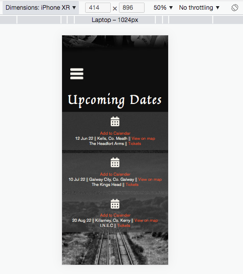

- __Testing the Home page__

I tested each individual link on the nav bar on the home page and each link brought me to the correct destination.

I discovered a bug during testing which caused the About and Contact page links to move up one pixel to accomodate the hover class underline animation. I noticed that this was not the case with the nav links on the opposite side. 

This appeared to be because of the assigned "Active class" indacator on the Home page. 

I fixed this bug using CSS and a class selector called "Inactive Class" on the opposite side. 

I will continue to look for an alternative solution to this problem as the development of the site continues.

I tested each link of the Sticky Nav Feature and found no errors.

I then tested each link on the Upcoming Dates section.

Each link opened in a new tab and to the correct URL.

Each link in the News section was then tested and one link was found to be missing a blank_ attribute value. 

This error was subsequently fixed.

I checked the spelling and grammar of the text content in this section and found no errors.

I tested the form element of this page and it functioned correctly.

Each of the footer links was checked and returned no errors.

- __Testing the Media page__

I tested each individual link on the nav bar on the Media page and each link brought me to the correct destination.

I tested each link of the Sticky Nav Feature and found no errors.

I then tested the playback for both tracks on the audio section.

The Audio Section functions correctly however, a limitation of the embedded audio player means that users must stop one track before playing another one. This is not an optimal user experience and I will look for better solutions to this issue as I continue the development of the site. 

I tested the video in the video section of the site and the content displayed correctly.

Each of the Gallery images loaded correctly.

I checked the spelling and grammar of the text content in this section and found no errors.

I tested the form element of this page and it functioned correctly.

Each of the footer links was checked and returned no errors.

- __Testing the About page__

I tested each individual link on the nav bar on the About page and each link brought me to the correct destination.

I tested each link of the Sticky Nav Feature and found no errors.

I then tested the link on the lower-bio section and it functioned correctly.

I checked the spelling and grammar of the text content in this section and found no errors.

I tested the form element of this page and it functioned correctly.

Each of the footer links was checked and returned no errors.

- __Testing the Contact page__

I tested each individual link on the nav bar on the Contact page and each link brought me to the correct destination.

I tested each link of the Sticky Nav Feature and found no errors.

I then tested the email links on the contact section and there were no errors returned.

I checked the spelling and grammar of the text content in this section and found no errors.

I tested the form element of this page and it functioned correctly.

Each of the footer links was checked and returned no errors.

- __Validator Testing__

I ran all of the sites pages through the W3C validator and each page returned multiple errors.

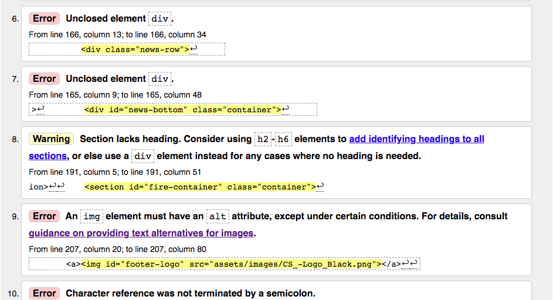

I corrected the code and all four pages now return no html errors.

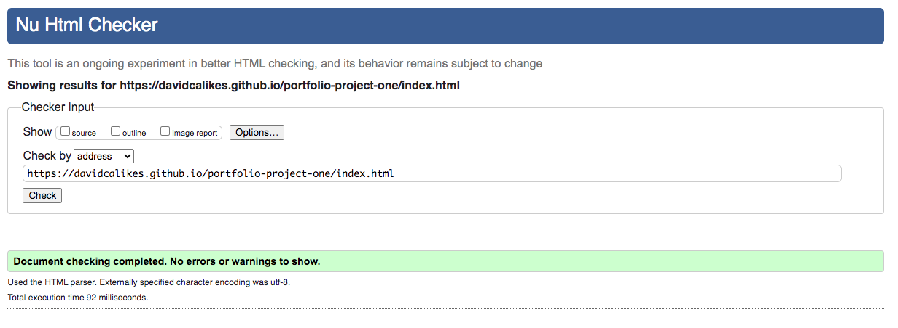

* The CSS stylesheet was passed through the Jigsaw Validator and returned no errors.

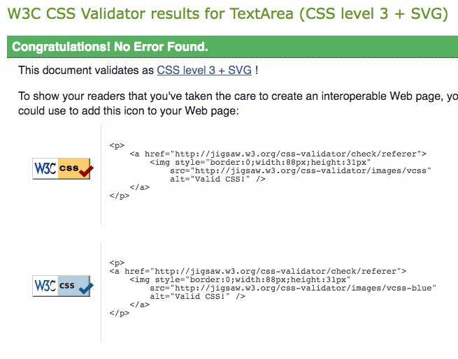

 

- __Performance Testing__

    I used Lighthouse to check site performance. The site performs well in most areas however the accesibility score was less than optimal.

    I then used the WCAG color contrast checker tool and it returned contrast errors with the deep orange color in the site's color scheme returning a contrast ratio of less than 3.0.

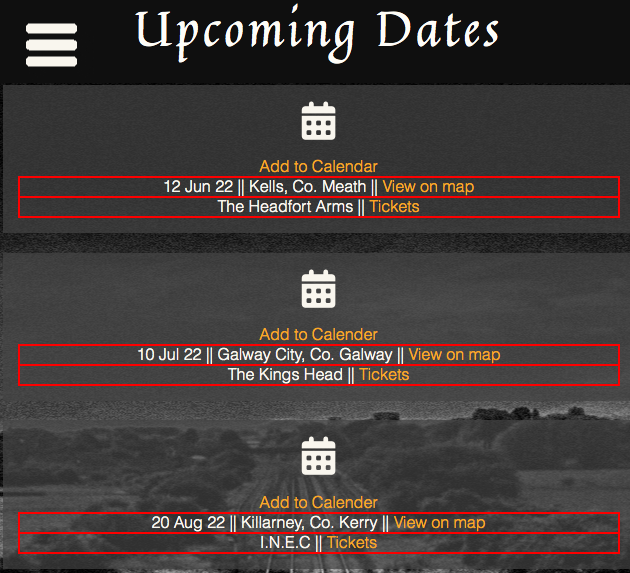

This was addressed by implementing a brighter orange color for text elements and links within the site. 

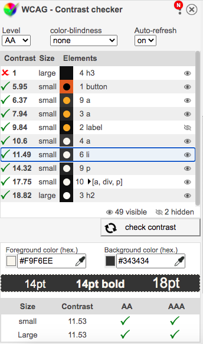

The site now returns just one contrasting error which is associated with the gradient I have used on the site's sub-headings. I have chosen to ignore this contrast warning as the image provided shows there is no visibility issue whatsoever and the error message appears to be simply a limitation of the WCAG's abilities.

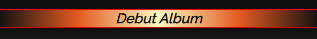

The site now achieves a 100% accesibility rating when performance is tested through lighthouse.

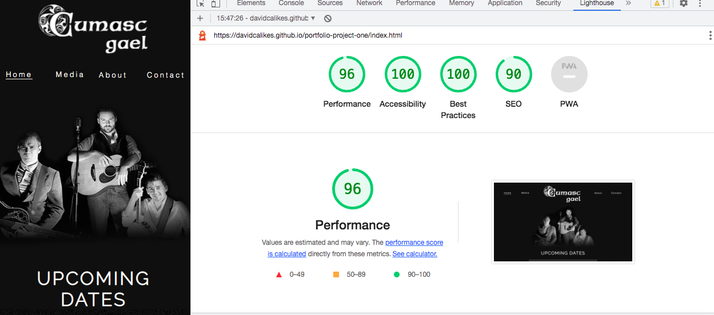

 

- __Other Bug Fixes__

    * On some touchscreen devices an error occurs due to the hover psuedo class which fails to deselect a nav link when a user returns to the previous page via the back arrow.
    
     

    This bug was fixed by the inclusion of the "inactive" class selector and by setting the nav link elements to display=hidden on smaller screen sizes. 
    
     

     

 

- __Unfixed Bugs__
 
 Although there are no known bugs present within the site, I have left this section of the README file for cataloguing and fixing future bugs.

# Deployment

* The site was deployed to GitHub pages. The steps to deploy are as follows:
    * From this project's repository, navigate to the settings tab
    * From the left hand menu, select pages.
    * From the source section drop-down menu, select the Main Branch.
    * Once the main branch has been selected, the page will refresh and provide a link to the live project. 

The live link can be found here - https://davidcalikes.github.io/portfolio-project-one/index.html

   
# Languages

* The coding languages used to create this site were HTML and CSS.

     

# Software

* Gitpod to create, load and push my code to Github.

* Git, (Gitpod and Github) as my version control system for the site.
    
* Adobe Photoshop CS6 to edit some images. I mainly used Photoshop to add greyscale to color-photos and to create color gradient effects for background images.

* TinyPNG to compress web images.

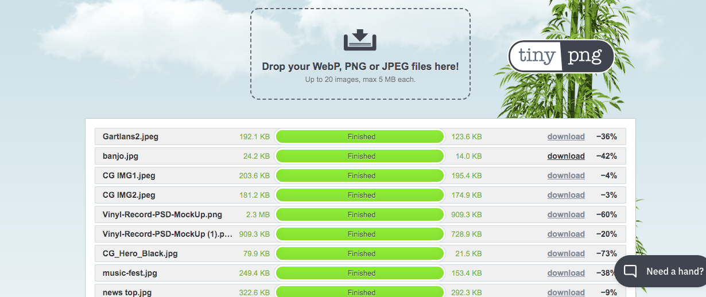

* Fotojet online image editor to add polaroid style borders to my image files, providing a consistant style across the site.

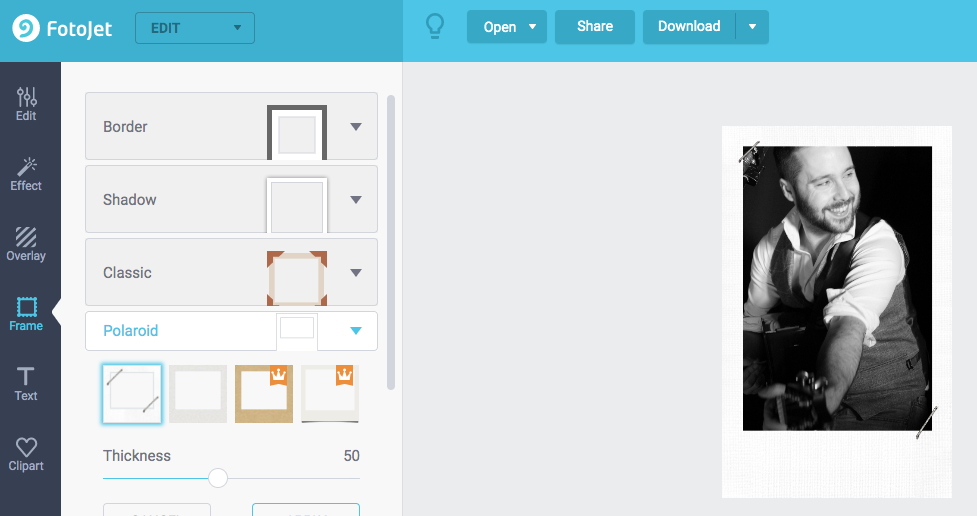

* Logic Pro X to produce and master the mp3 files.
    
    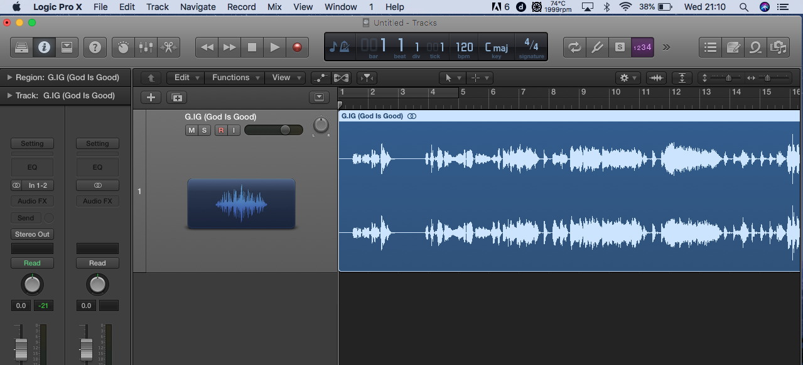

* Balsamiq wireframes software.

# Media

* The youtube video provided is used with the expressed written permission of Nexstar media. (formerly Fox46)

    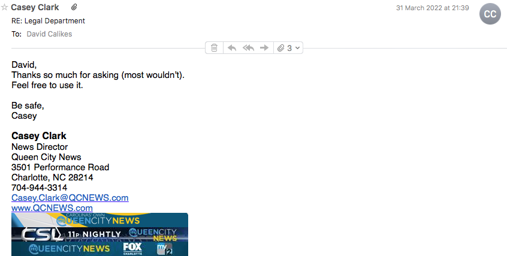

* The songs featured in the audio section of this site were written and produced by myself, David Calikes in 2016.

* The images featuring the band Cumasc Gael are used with the permission of David Calikes, Andrew Kelly and Liam Sheridan.

* The logo image of the band Cumasc Gael was designed by myself David Calikes in 2016

* The following images were aquired from public domain image site Pexels.com

    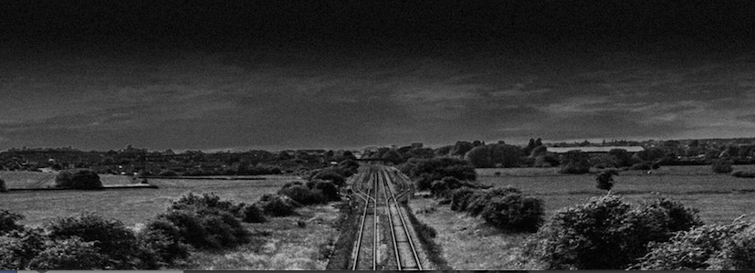
    
    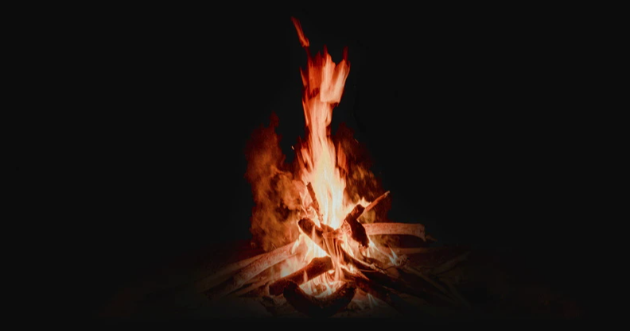
    

# Credits

- __Content__

    * The navigation section of this site is loosely based on a code snippet named "flex-test" provided to me by my Code Institute mentor Richard Wells.

    * The fade-in effect for the hero image is from this article on Stack Overflow: https://stackoverflow.com/questions/11679567/using-css-for-a-fade-in-effect-on-page-load

    * The Sticky Navigation Menu is derived from snippets of code from this repository: https://github.com/iamshaunjp/CSS-Tips-and-Tricks/blob/04-css-only-dropdown-menu/css-only-dropdown/styles.css

    * The form on the site is inspired by the Code Institute's Coders Coffeehouse code along project.

    * The CSS styling used to hide the labels of the form inputs was derived from this tutorial: https://webaim.org/techniques/css/invisiblecontent/

    * All text icons used on the site were sourced from: https://fontawesome.com/search?m=freecom

    * The link to the favicon icon on all four pages is from: https://favicon.io/

- __Thanks__

    * Kasia Boguka: Code Institute Cohort Facilitator.

        Kasia is seemingly always available to chat code and always leaves me feeling more confident about my progress as a developer whenever we talk. I'll never fully understand people who prefer Tea to Coffee but Kasia makes me at least want to try... ;)

    * Richard Wells: Code Institute Mentor.

        Richard's expertise during this project was invaluable and my project benefitted greatly due to his mentorship. 
        Richard was also extremely generous with his time and our online sessions would often overun. For this I am truly grateful.

    * Helen Mill: Code Institute Admissions Executive
    
        I count myself extremely fortunate to have been afforded the opportunity to study with the Code Institute and would like to thank Helen for giving me the chance.

    * Liam Sheridan and Andrew Kelly (Cumasc Gael)
    
        Our wee American adventure many moons ago was hugely enjoyable and I am priveliged to have worked with such outstanding musicians. 

    * Michelle Calikes
    
        I am hugely thankful for the time my wife has afforded me to work on this project. Thank you Michelle from the bottom of my heart. 
    

 

